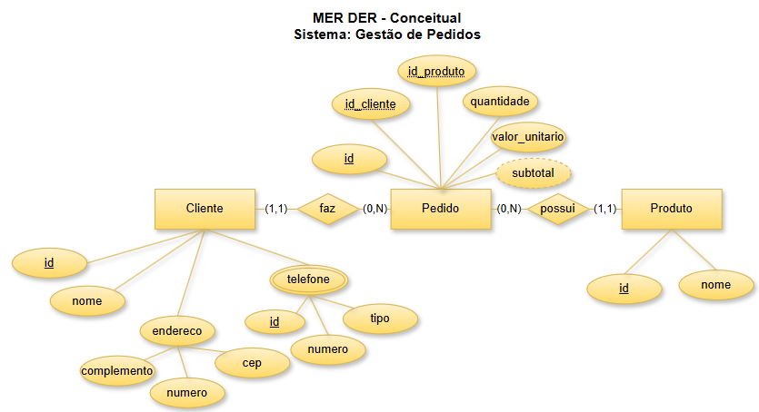
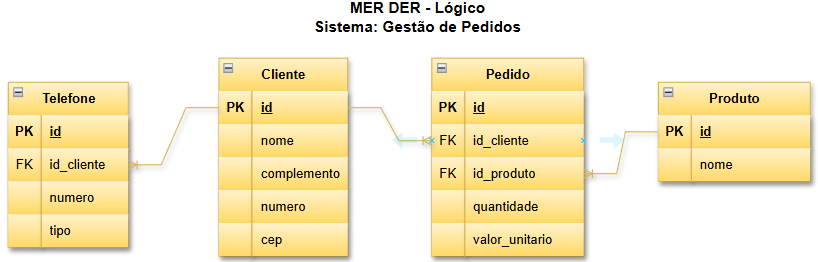

# Projeto: Gestão de Pedidos

## Dicionário de Dados

| Entidade | Atributo | Tipo | Tamanho| Descrição |
|-|-|-|-|-|
| Cliente | id | Inteiro | 11 | Identificador, PK, Auto incrementável |
| Cliente | nome | Texto | 100 | Nome do cliente |
| Cliente | cep | Texto | 11 | CEP do cliente |
| Cliente | numero | Inteiro | 11 | Número do endereço do cliente |
| Cliente | complemento | Texto | 100 | Complemento do endereço do cliente |
| Telefone | id | Inteiro | 11 | Identificador, PK, Auto incrementável |
| Telefone | id_cliente | Inteiro | 11 | Identificador do cliente, FK referenciando Cliente (id)|
| Telefone | numero | Texto | 15 | Número do telefone |
| Telefone | tipo | Texto | 20 | Tipo do telefone (ex: celular, residencial, comercial) |
|Produto | id | Inteiro | 11 | Identificador, PK, Auto incrementável |
|Produto | nome | Texto | 100 | Nome do produto |
|Pedido | id | Inteiro | 11 | Identificador, PK, Auto incrementável |
|Pedido | id_cliente | Inteiro | 11 | Identificador do cliente, FK referenciando Cliente (id)|
|Pedido | valor_unitario | Decimal | 10,2 | Valor unitário do pedido |
|Pedido | quantidade | Inteiro | 11 | Quantidade do pedido |
|Pedido | subtotal | Decimal | 10,2 | Subtotal do pedido derivado de: (valor_unitario * quantidade) |

## Dados de teste em CSV
- [cliente.csv](./cliente.csv)
- [telefone.csv](./telefone.csv)
- [produto.csv](./produto.csv)
- [pedido.csv](./pedido.csv)# sesi_bcd_aula03_mer_der_dd_dados_2026
