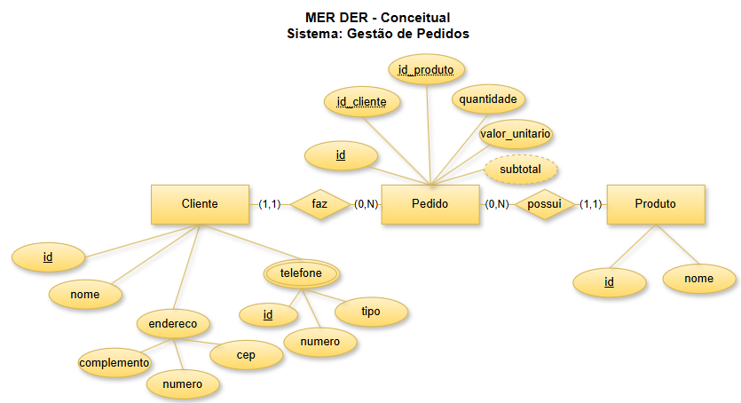
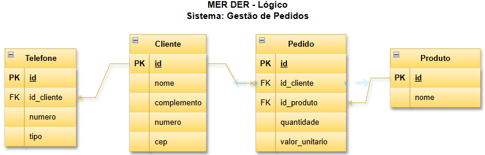

# Projeto: Gestão de Pedidos




## Dicionário de Dados

| Entidade | Atributo | Tipo | Tamanho| Descrição |
|-|-|-|-|-|
| Cliente | id | Inteiro | 11 | Identificador, PK, Auto incrementável |
| Cliente | nome | Texto | 100 | Nome do cliente |
| Cliente | cep | Texto | 11 | CEP do cliente |
| Cliente | numero | Inteiro | 11 | Número do endereço do cliente |
| Cliente | complemento | Texto | 100 | Complemento do endereço do cliente |
| Telefone | id | Inteiro | 11 | Identificador, PK, Auto incrementável |
| Telefone | id_cliente | Inteiro | 11 | Identificador do cliente, FK referenciando Cliente (id)|
| Telefone | numero | Texto | 15 | Número do telefone |
| Telefone | tipo | Texto | 20 | Tipo do telefone (ex: celular, residencial, comercial) |
|Produto | id | Inteiro | 11 | Identificador, PK, Auto incrementável |
|Produto | nome | Texto | 100 | Nome do produto |
|Pedido | id | Inteiro | 11 | Identificador, PK, Auto incrementável |
|Pedido | id_cliente | Inteiro | 11 | Identificador do cliente, FK referenciando Cliente (id)|
|Pedido | id_produto | Inteiro | 11 | Identificador do produto, FK referenciando Produto (id)|
|Pedido | valor_unitario | Decimal | 10,2 | Valor unitário do pedido |
|Pedido | quantidade | Inteiro | 11 | Quantidade do pedido |
|Pedido | subtotal | Decimal | 10,2 | Subtotal do pedido derivado de: (valor_unitario * quantidade) |

## Dados de teste em CSV
- [cliente.csv](./cliente.csv)
- [telefone.csv](./telefone.csv)
- [produto.csv](./produto.csv)
- [pedido.csv](./pedido.csv)

## Script SQL DDL (Desenvolvimanto: Criação do Banco de dados)
```sql
drop database if exists gestao_pedidos;
create database gestao_pedidos;
use gestao_pedidos;
create table produto(
    id int not null primary key auto_increment,
    nome varchar(100) not null
);
create table telefone(
    id int not null primary key auto_increment,
    id_cliente int not null,
    numero varchar(100) not null unique,
    tipo enum('Residencial', 'Comercial', 'Celular') not null
);
create table cliente(
    id int not null primary key auto_increment,
    nome varchar(100) not null,
    cep varchar(11) not null,
    numero varchar(10),
    complemento varchar(100)
);
create table pedido(
    id int not null primary key auto_increment,
    id_cliente int not null,
    id_produto int not null,
    quantidade int not null,
    valor_unitario decimal(10,2) not null,
    subtotal decimal(10,2) default (valor_unitario * quantidade)
);

alter table telefone add constraint fk_telefones foreign key (id_cliente) references cliente(id);
alter table pedido add constraint fk_faz foreign key (id_cliente) references cliente(id);
alter table pedido add constraint fk_possui foreign key (id_produto) references produto(id);

describe produto;
describe telefone;
describe cliente;
describe pedido;
show tables;
```
## Script SQL DML(Manipulação: População com dados de teste)
```sql
use gestao_pedidos;
insert into cliente(nome, complemento, numero, cep) values
("Ana Maria Silva",null,"21","13905-522"),
("Valentina Oliveira","Ap:19 Bloco:2","12","13903-333"),
("Enzo Martins","Ap: 19"," 195B","13903-235");

insert into telefone(id_cliente,numero,tipo) values
(1,"19 99987-8789","Celular"),
(1,"19 99980-4848","Celular"),
(2,"19 98450-1212","Residencial"),
(3,"19 99988-2121","Celular"),
(3,"19 99777-2222","Residencial"),
(3,"19 99900-1010","Comercial");

insert into produto(nome) values
("Impressora laser"),
("Impressora deskjet"),
("Impressora matricial"),
("Impressora mobile");

insert into pedido(id,id_produto,id_cliente,quantidade,valor_unitario) values
(1005,1,1,5,1500.00),
(1006,2,1,3,350.00),
(1007,3,2,1,190.00),
(1008,4,3,6,980.00);

select * from cliente;
select * from telefone;
select * from produto;
select * from pedido;
```